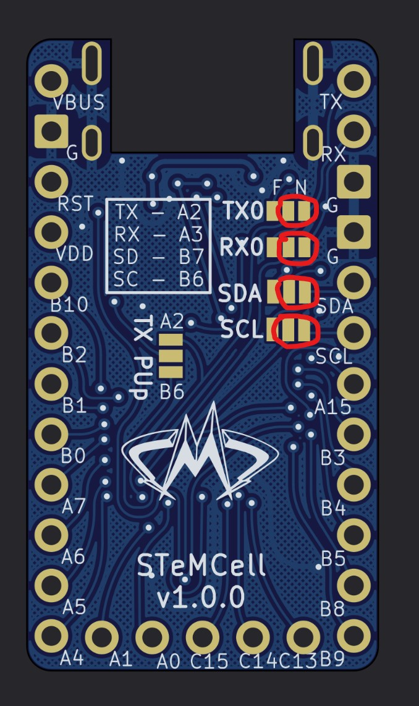

# STeMcell

Generally, here are some notes and/or tips about using a STeMcell

If you are interested in learning more from the creator, you can do so here:
* https://megamind4089.github.io/STeMCell/
* https://github.com/megamind4089/STeMCell

# Firmware

At the time of this writing (2022-06-06), you should use the stemcell_v1.0.1_plus branch ( https://github.com/sadekbaroudi/qmk_firmware/tree/stemcell_v1.0.1_plus ) to build your firmware for the STeMcell. Once the STeMcell is fully supported and tested for fingerpunch boards, I'll update master and will delete this branch.

In order to make STeMcell compatible firmware from this branch, you simply need to run the make command you would normally run, but add "STMC=yes" to the end. This will generate a uf2 file, which you will use to flash it.

Starting with no repository, here's an example of building stock ffkb firmware with rgbmatrix and ec11 encoders:
```bash
# Cloning the repo
git clone {YOUR_USERNAME}git@github.com:sadekbaroudi/qmk_firmware.git
cd qmk_firmware
git submodule update --init --recursive
# Checking out the stemcell repo
git checkout -b stemcell_v1.0.1_plus origin/stemcell_v1.0.1_plus
git submodule update
# Running the firmware build
make fingerpunch/ffkb_byomcu/rgbmatrix_ec11:default STMC=yes

# Build firmware will be .build/fingerpunch_ffkb_byomcu_rgbmatrix_ec11_default.uf2
# Copy it somewhere where you can drag and drop it to flash your STeMcell
```

# Flashing

## Resetting the controller for flashing

You have a few options for putting the STeMcell into flashing mode
* Short RST and GND pins on the controller itself
* Double tap the physical reset switch on the keyboard pcb itself
* Use the QMK reset keycode

## Flashing the firmware itself

Given this is using the tinyuf2 bootloader, flashing is VERY simple. When you go into flashing mode, a window will pop up on your machine (like putting a USB drive into your machine). All you need to do is copy the .uf2 file into the root directory, and you're done!

# Soldering

## STeMcell Jumpers

The first thing you should do is solder the jumpers on the back of the STeMcell, as shown in the image below.



# Testing

Before soldering the controller onto your pcb, you may want to test that you soldered the jumpers correctly. If so, see this:
https://github.com/sadekbaroudi/fingerpunch/blob/master/stemcell/JUMPER_TESTER.md